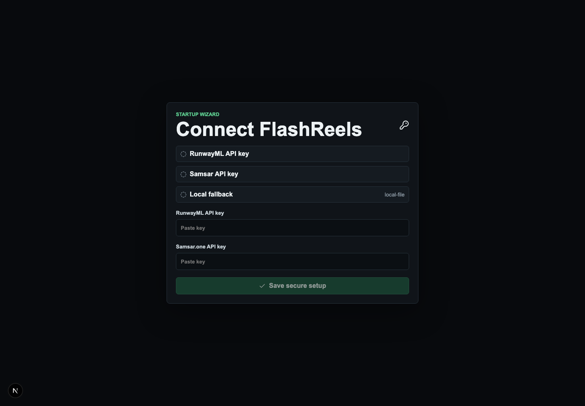
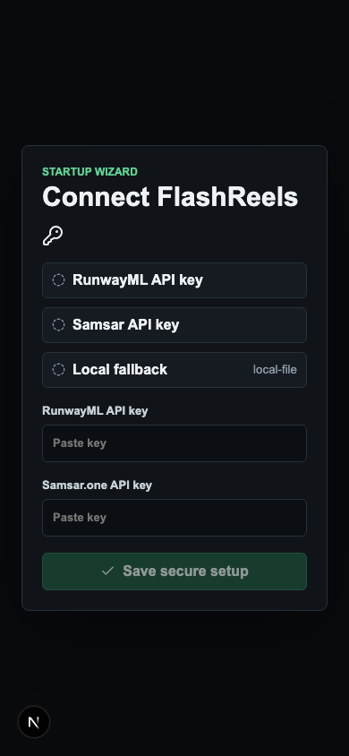

# FlashReels

<div align="center">
  

| Coming Soon |
| --- |
| **A minimal, step-controlled reel production desk for marketing teams and video editors.** |

</div>

FlashReels is a Next.js workspace for prompt-led and image-led short-form video generation. It is built around RunwayML generation so teams can compose a request, preview each completed stage, and keep a lightweight private library of finished outputs.

RunwayML is the primary creative generation provider for image and video assets. FlashReels uses it for text-to-image, image-to-video, task polling, and normalized output URLs. Defaults are `gen4_image` for images and `gen4.5` for image-to-video.

`samsar-js` is used briefly as the orchestration layer for Samsar v2 step-video jobs: creating requests, checking detailed status, and advancing to the next stage.

## Screenshots

| Desktop | Mobile |
| --- | --- |
|  |  |

## Content Flow

FlashReels does not ship bundled creative content. Prompts, reference images, generated frames, and generated videos move through the available APIs:

- `POST /api/samsar/step/start` creates a step-video request for `text_to_video` or `image_list_to_video`.
- `GET /api/samsar/step/status-detailed` returns render status plus stage resources for preview.
- `POST /api/samsar/step/process-next` advances the active request after review.
- `POST /api/runway/text-to-image` submits RunwayML text-to-image work.
- `POST /api/runway/image-to-video` submits RunwayML image-to-video work.
- `GET /api/runway/{adapter}/requests/{requestId}` returns normalized image or video results.
- `GET /api/library` and `POST /api/library` read and save private rendered-video records.

## Setup

```bash
npm install
npm run dev
```

Configure keys in the startup wizard or through environment variables:

- `FLASHREELS_RUNWAYML_API_KEY`
- `FLASHREELS_SAMSAR_API_KEY`

Optional defaults are documented in `.env.example`, including base URLs, Runway model names, and Vercel Redis / Upstash persistence variables.

## API Keys

RunwayML:

1. Sign in to RunwayML.
2. Open the developer or API settings area.
3. Create an API key.
4. Add it in the FlashReels startup wizard or set `FLASHREELS_RUNWAYML_API_KEY`.

Samsar:

1. Sign in to Samsar.
2. Open the API key settings for your account.
3. Create an API key.
4. Add it in the FlashReels startup wizard or set `FLASHREELS_SAMSAR_API_KEY`.

## Credits

Response to RunwayML hackathon 2026.

## License

MIT. See [LICENSE](./LICENSE).
